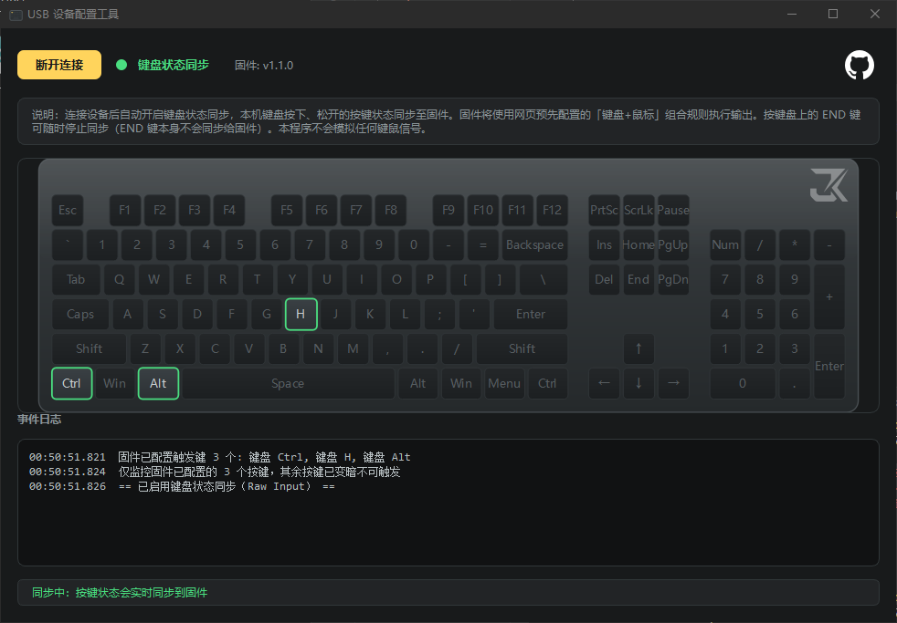

# USB 设备配置工具上位机（Qt / C++）


用于连接 **JiKong K1** 固件，通过 USB HID Feature Report
同步本机键盘按下/松开状态给固件，并读取固件已配置的触发键作为可监控范围。
键盘 UI 复刻自网页配置工具 `config-tool-web` 中"捕获触发键"弹窗的
108 键键盘 SVG 布局与外观，工具并非无差别捕获所有按键，未配置的键变暗不可用，避免无意义的全量输入监控。

## 功能

- 自绘 108 键键盘（圆角外壳 + 顶部高光 + 键帽），视觉与网页版一致；
- 连接设备后自动开启键盘状态同步，本机键盘按下/松开实时同步给固件；
- 按 END 键可随时停止同步（END 键本身不会同步给固件）；
- 读取固件中已配置的触发键作为白名单：已配置的键正常显示（绿色描边表示可用，
  按下变黄高亮），未配置的键变暗不可用，避免无意义的全量输入监控；
- 顶部圆点指示灯显示连接状态：断开红色，已连接绿色；
- 通信协议（命令码、32 字节帧、小端、CRC32）与固件严格一致。

## 依赖

- CMake ≥ 3.16
- Qt 5 或 Qt 6（Widgets、Svg 模块）
- hidapi（开发库 + 头文件）

## 构建

### Windows（推荐 vcpkg）

```powershell
vcpkg install hidapi qtbase
cmake -B build -S . -DCMAKE_TOOLCHAIN_FILE=<vcpkg>/scripts/buildsystems/vcpkg.cmake
cmake --build build --config Release
```

若手动安装 hidapi，可用 `-DHIDAPI_ROOT=<hidapi路径>` 指定（其下需有 `include/` 与 `lib/`）。

### Linux

```bash
sudo apt install cmake qtbase5-dev libhidapi-dev   # 或 qt6-base-dev
cmake -B build -S .
cmake --build build -j
```

Linux 下访问 HID 设备通常需要 udev 规则或以 root 运行。

### macOS

```bash
brew install cmake qt hidapi
cmake -B build -S . -DCMAKE_PREFIX_PATH=$(brew --prefix qt)
cmake --build build -j
```

## 使用

1. 连接设备，点“连接设备”。程序会自动匹配设备并选中配置接口，
   随后自动读取当前配置与已设置的触发键。
2. 连接成功后自动开启键盘状态同步：键盘上绿色描边的键为固件已配置、
   可被监控的按键，其余键变暗不响应。
3. 按下白名单内的键会实时同步给固件、并在键盘上黄色高亮；按 END 键可随时
   停止同步。
4. 事件日志区显示按下/松开记录；底部状态栏显示当前连接与同步状态。

## 协议一致性说明

关键常量与网页 `config-tool-web/js/constants.js`、`protocol.js`、`crc.js` 对齐：

- 帧长固定 `32` 字节，配置帧末尾含 CRC32 校验；
- 帧格式：`[version][command][fields... 小端][CRC32 小端]`；
- 通信全程走 USB HID Feature Report，命令码与字段顺序均与固件、网页版一致。

## 目录结构

```
qt-config-tool/
├── CMakeLists.txt
└── src/
    ├── main.cpp              程序入口
    ├── protocol.h/.cpp       协议常量、CRC32、32 字节帧构建
    ├── device.h/.cpp         hidapi 通信层（连接/读配置/读触发键/状态同步）
    ├── inputworker.h/.cpp    键盘捕获 + HID 通信独立工作线程
    ├── keyboardlayout.h/.cpp 108 键布局数据（移植自 keyboard-diagram.js）
    ├── keyboardwidget.h/.cpp 自绘键盘控件（复刻 SVG 外观 + 点击/高亮/可用状态）
    ├── usages.h/.cpp         usage <-> 可读名称
    └── mainwindow.h/.cpp     主界面与交互流程
```
